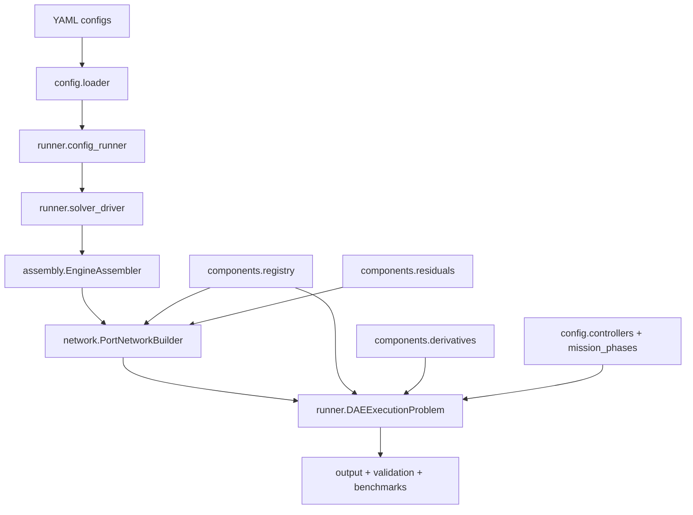

# ATHA architecture and package map

## Canonical production path

```text
YAML config folder
  -> atha.config.loader.load_analysis_config / load_config_folder
  -> atha.runner.config_runner.run_config_folder
  -> atha.runner.solver_driver.SolverDriver
  -> analysis handler (profile / steady / linearization / parity)
  -> atha.assembly.EngineAssembler
  -> atha.network.ports.PortNetworkBuilder  (algebraic port network)
  -> atha.runner.dae_execution.DAEExecutionProblem
       - schedules / timings / operating targets
       - mission phases + controllers
       - residual contracts (Z / Rz)
       - derivative contracts (dX/dt)
  -> outputs / acceptance / regression / parity / benchmarks
```

This is the only path that retained examples 19–23 are expected to use.

## Execution layers

| Layer | Module | Responsibility |
| --- | --- | --- |
| Config loading | `atha.config.loader`, `schema` | Parse YAML folder, validate against schema, bind maps/controllers/transients |
| Assembly | `atha.assembly.EngineAssembler` | Source catalog (cached), initial vectors, wrap balances onto the port network |
| Network solve | `atha.network.ports`, `problem`, `preconditioner` | Build `Z`/`Rz`, design preconditioning, direct or nonlinear algebraic solve |
| Transient execution | `atha.runner.dae_execution` | Segmented integration, phase transitions, controller period sampling, state modes |
| Controllers | `atha.config.controllers`, `mission_phases` | Phase-gated feedback / open-loop commands; optional second-pass skip when commands unchanged |
| Outputs | `atha.output.*` | Telemetry CSV/HDF5/plots, provenance |
| Verification | `atha.validation.*` | Acceptance, regression, parity, reference checks, verification suite |
| Benchmarks | `atha.benchmarks`, `scripts/run_benchmarks.py` | Wall time, algebraic solve counts, residual/output metrics |

## Package map

| Package / module | Role |
| --- | --- |
| `atha/config/` | YAML schema, schedules, controllers, mission-phase helpers, maps, transients |
| `atha/assembly/` | Source catalog, initial vectors, network assembly helpers |
| `atha/network/` | `NetworkProblem`, port-network builder, preconditioner |
| `atha/components/` | Registry, residual/derivative contracts, dual-use OOP component classes |
| `atha/runner/` | CLI runner, DAE execution, solver driver, artifacts |
| `atha/analysis/` | Analysis-mode handlers and reporting helpers |
| `atha/output/` | Telemetry, plotting, provenance, comparison |
| `atha/validation/` | Acceptance / regression / parity / reference / suite checks |
| `atha/benchmarks/` | Lightweight runtime benchmark cases |
| `atha/thermo/` | Cantera / CoolProp / ideal-gas backends |
| `atha/maps/` | Performance-map interpolation |
| `atha/solver/` | Legacy `EngineLayout` solvers + algebraic aliases |
| `atha/core/` | OOP `BaseComponent` / port objects (still used by OOP components) |
| `atha/jannaf/` | OOP nozzle efficiency helpers (not the DAE residual path) |
| `atha/examples/` | **Orphaned** legacy `EngineLayout` helpers — do not extend |

## Architecture diagram



## Supported vs legacy construction

### Supported (canonical)

- Component identity from `atha.components.registry`
- Algebraic physics from residual contracts in `atha.components.residuals`
- Transient plant physics from derivative contracts in `atha.components.derivatives`
- Topology assembly from `PortNetworkBuilder`
- Mission execution from `DAEExecutionProblem`
- Verification from `atha.validation` + `tests/`

### Legacy / non-canonical

| Path | Status | Notes |
| --- | --- | --- |
| `atha.components.factory.build_component_from_config` | Legacy | Emits `DeprecationWarning`; only Valve / Injector / Chamber / Nozzle |
| `atha.solver.steady_state.SteadyStateSolver` | Legacy | Operates on OOP `EngineLayout` |
| `atha.solver.transient.TransientSolver` | Legacy | Operates on OOP `EngineLayout` |
| `atha.solver.nonlinear` | Legacy helper | Used only by the EngineLayout solvers above |
| `atha.examples.*` | Orphaned | No retained example imports this package |
| OOP classes under `atha/components/*.py` | Dual-use | Useful physics reference; not all methods are wired into the DAE path |
| `atha.jannaf.*` | Dual-use | OOP nozzle path only; DAE nozzles use residual contracts |
| `MetalNode` | Unregistered | Not available in YAML registry yet |

## Mission-phase control architecture

Phases are declared in `analysis.time.phases`. Controllers may use:

- `active_phases`
- `inactive_phases`
- `reset_on_enter`
- `hold_when_inactive`

Helpers live in `atha.config.mission_phases` and are consumed by `DAEExecutionProblem`.

## Runtime performance notes (Workstream 6.3)

- `EngineAssembler.source_catalog()` is cached per assembled config.
- Runtime performance maps are built once and reused by the preconditioner.
- Controller sample-period cache returns the held mapping by reference.
- When post-measurement commands match the open-loop pass, the second algebraic
  network solve is skipped (`algebraic_solve_skip_count`).

## Design rules for contributors

1. Add new physics through residual/derivative contracts first.
2. Register the type in `default_component_registry()`.
3. Prefer YAML examples over ad hoc Python model scripts.
4. Do not extend the legacy factory unless explicitly maintaining `EngineLayout` compatibility.
5. Keep subsystem MVP cases under `examples/21_generic_port_subsystems/`.
6. Follow `CONTRIBUTING.md` for lint, test, and benchmark workflows.
